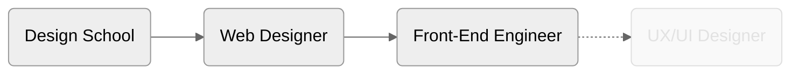

Thank you for visiting my repository!

### Resources

- [About Me | LinkedIn](https://www.linkedin.com/in/paglinawan0520/)
- [Portfolio | LinkedIn](https://www.linkedin.com/in/paglinawan0520/recent-activity/articles/)
- [My Creations | Behance](https://www.behance.net/mihohoriuchi)

### My Journey

### My Skill

- `HTML` / `CSS` / `SCSS` ★★★★★
- `React` / `Next.js` / `jQuery` ★★★☆☆
- `TypeScript` ★★★☆☆
- `Ruby on Rails` ★☆☆☆☆
- `WordPress` ★★★☆☆
- `Shopify` ★★☆☆☆

- `Figma` ★★★★☆
- `XD` ★★★☆☆
- `Photoshop` ★★★☆☆
- `Illustrator` ★☆☆☆☆
